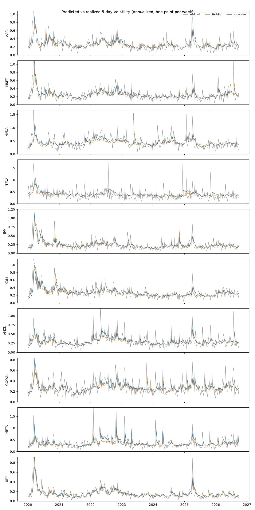
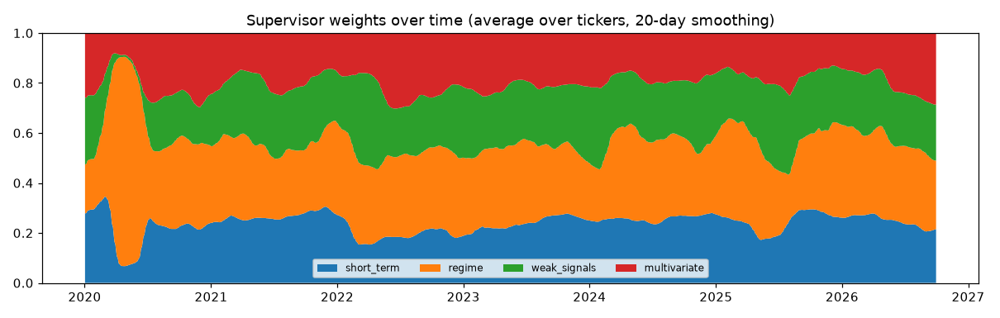
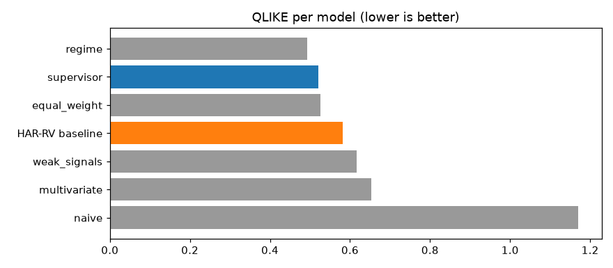

# Backtest report

Generated by `python -m tsm.backtest`. Do not edit by hand.

## Summary

The supervisor beats the HAR-RV baseline on QLIKE: 0.5202 against 0.5824 (+10.7%), and +2.0% on RMSE. It is better than HAR-RV on 10 of 10 tickers. The difference is statistically solid (t-statistic 5.05; about 2 or more is the usual bar). The best model on QLIKE is the skill `regime`, not the supervisor. Against a plain equal-weight average of the same skills, the supervisor's dynamic weighting changes QLIKE by +1.1% (positive = the weighting helps).

## Setup

- **Tickers (10):** AAPL, MSFT, NVDA, TEVA, JPM, XOM, AMZN, GOOGL, META, SPY
- **Test period:** 2020-01-02 to 2026-09-30, 1695 evaluation dates (every trading day), 16950 scored predictions.
- **Target:** annualized 5-trading-day realized volatility, as defined in `contracts/README.md`.
- **Method:** walk-forward. On each date every skill sees only prices up to that date. Skills start predicting on 2018-01-02; the dates before 2020-01-01 are used only to choose the supervisor's two settings and are not scored here.
- **Supervisor settings:** window of 60 past predictions, softmax temperature 0.25.
- **Model version:** 0.1.0. **Report generated:** 2026-10-08. **Last price date:** 2026-10-07.

## Metrics vs baselines

Lower is better for all three metrics. The "vs HAR-RV" columns are the improvement over the baseline (positive = better than HAR-RV). Best value per column in bold.

| Model | RMSE | MAE | QLIKE | RMSE vs HAR-RV | MAE vs HAR-RV | QLIKE vs HAR-RV |
| --- | ---: | ---: | ---: | ---: | ---: | ---: |
| **Supervisor (the market)** | 0.1721 | 0.1103 | 0.5202 | +2.0% | +1.1% | +10.7% |
| HAR-RV baseline (= skill `short_term`) | 0.1756 | 0.1115 | 0.5824 | — | — | — |
| Skill `regime` | 0.1823 | 0.1234 | **0.4934** | -3.8% | -10.6% | +15.3% |
| Skill `weak_signals` | 0.1750 | **0.1053** | 0.6158 | +0.3% | +5.6% | -5.7% |
| Skill `multivariate` | 0.1756 | 0.1106 | 0.6530 | +0.0% | +0.9% | -12.1% |
| Naive (last 5-day volatility) | 0.2128 | 0.1376 | 1.1699 | -21.2% | -23.4% | -100.9% |
| Equal-weight average of the skills | **0.1703** | 0.1077 | 0.5258 | +3.0% | +3.5% | +9.7% |

The skill `short_term` is the HAR-RV model, so it and the baseline are one and the same row.

## Average weight per skill

| Skill | Horizon | Mean weight | Min | Max |
| --- | --- | ---: | ---: | ---: |
| `short_term` | short | 0.237 | 0.001 | 0.510 |
| `regime` | long | 0.331 | 0.066 | 0.987 |
| `weak_signals` | short | 0.230 | 0.000 | 0.768 |
| `multivariate` | medium | 0.202 | 0.000 | 0.725 |

Per ticker (mean weight of each skill, and QLIKE of the supervisor against HAR-RV):

| Ticker | `short_term` | `regime` | `weak_signals` | `multivariate` | Supervisor QLIKE | HAR-RV QLIKE |
| --- | ---: | ---: | ---: | ---: | ---: | ---: |
| AAPL | 0.246 | 0.321 | 0.238 | 0.195 | 0.4687 | 0.5094 |
| MSFT | 0.228 | 0.306 | 0.265 | 0.201 | 0.4773 | 0.5527 |
| NVDA | 0.258 | 0.336 | 0.180 | 0.227 | 0.4423 | 0.4773 |
| TEVA | 0.274 | 0.371 | 0.171 | 0.184 | 0.6423 | 0.6693 |
| JPM | 0.229 | 0.326 | 0.257 | 0.188 | 0.5591 | 0.6213 |
| XOM | 0.229 | 0.290 | 0.241 | 0.240 | 0.3488 | 0.3962 |
| AMZN | 0.240 | 0.324 | 0.236 | 0.200 | 0.5017 | 0.5570 |
| GOOGL | 0.229 | 0.317 | 0.248 | 0.206 | 0.4975 | 0.5575 |
| META | 0.219 | 0.392 | 0.215 | 0.174 | 0.8109 | 0.9551 |
| SPY | 0.222 | 0.322 | 0.252 | 0.203 | 0.4533 | 0.5279 |

## Charts

## Caveats

- Ten large, liquid US-listed names over one period that includes the 2020 crash. Results may not carry over to other stocks or calmer or wilder periods.
- Consecutive evaluation dates share 4 of their 5 target days, so the 16950 scored predictions are far from independent. The t-statistic above corrects for this; the raw count overstates the evidence.
- "Realized volatility" here comes from 5 daily closing prices, which is itself a noisy measure of true volatility. Part of every model's error is noise in the target.
- The supervisor's window and temperature were chosen once, on predictions from before 2020-01-01, and not touched afterwards. The skills' own settings (network size, tree depth, feature windows) were fixed by hand and not tuned.
- The iTransformer is deliberately small (hidden size 64, 300 training steps, retrained every 125 trading days) to keep the run short on CPU. A larger network might do better or worse; this was not explored.
- Prices are adjusted for splits and dividends as of the download date.
