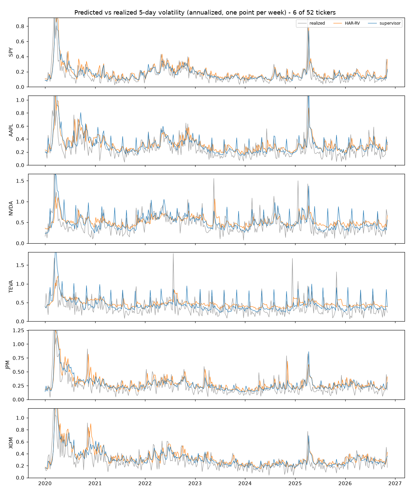
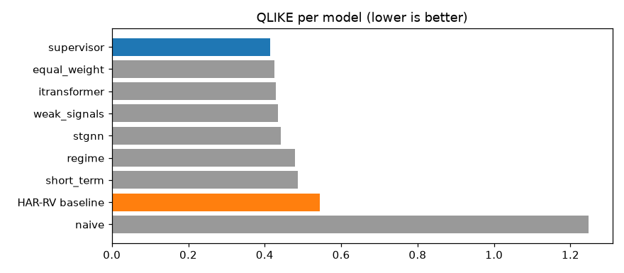

# Backtest report

Generated by `python -m tsm.backtest`. Do not edit by hand.

## Summary

The supervisor beats the HAR-RV baseline on QLIKE: 0.4145 against 0.5448 (+23.9%), and +13.6% on RMSE. It is better than HAR-RV on 52 of 52 tickers. The difference is statistically solid (t-statistic 8.12; about 2 or more is the usual bar). Against a plain equal-weight average of the same skills, the supervisor's dynamic weighting changes QLIKE by +2.7% (positive = the weighting helps).

## Setup

- **Tickers (52):** AAPL, MSFT, NVDA, AVGO, ORCL, GOOGL, META, NFLX, DIS, TMUS, AMZN, TSLA, HD, MCD, LOW, WMT, COST, PG, KO, PEP, LLY, JNJ, UNH, ABBV, MRK, JPM, BRK-B, V, MA, BAC, XOM, CVX, COP, EOG, SLB, CAT, UNP, DE, LMT, ETN, SHW, APD, ECL, NEM, FCX, NEE, SO, DUK, AEP, SRE, TEVA, SPY
- **Test period:** 2020-01-02 to 2026-11-06, 1722 evaluation dates (every trading day), 89544 scored predictions.
- **Target:** annualized 5-trading-day realized volatility, as defined in `contracts/README.md`.
- **Method:** walk-forward. On each date every skill sees only prices up to that date. Skills start predicting on 2018-01-02; the dates before 2020-01-01 are used only to choose the supervisor's two settings and are not scored here.
- **Supervisor settings:** each skill judged on all tickers together (pooled), the same weights for every ticker; window of 250 past evaluation dates, softmax temperature 0.02.
- **Model version:** 0.1.0. **Report generated:** 2026-11-15. **Last price date:** 2026-11-13.

## Metrics vs baselines

Lower is better for all three metrics. The "vs HAR-RV" columns are the improvement over the baseline (positive = better than HAR-RV). Best value per column in bold.

| Model | RMSE | MAE | QLIKE | RMSE vs HAR-RV | MAE vs HAR-RV | QLIKE vs HAR-RV |
| --- | ---: | ---: | ---: | ---: | ---: | ---: |
| **Supervisor (the market)** | **0.1582** | **0.1047** | **0.4145** | +13.6% | +14.5% | +23.9% |
| HAR-RV baseline (plain `short_term`, no earnings jump) | 0.1831 | 0.1224 | 0.5448 | — | — | — |
| Skill `short_term` | 0.1734 | 0.1144 | 0.4873 | +5.3% | +6.5% | +10.6% |
| Skill `regime` | 0.1703 | 0.1125 | 0.4799 | +7.0% | +8.1% | +11.9% |
| Skill `weak_signals` | 0.1668 | 0.1079 | 0.4343 | +8.9% | +11.8% | +20.3% |
| Skill `itransformer` | 0.1612 | 0.1078 | 0.4282 | +12.0% | +12.0% | +21.4% |
| Skill `stgnn` | 0.1602 | 0.1077 | 0.4415 | +12.5% | +12.0% | +19.0% |
| Naive (last 5-day volatility) | 0.1945 | 0.1251 | 1.2471 | -6.3% | -2.2% | -128.9% |
| Equal-weight average of the skills | 0.1592 | 0.1066 | 0.4258 | +13.0% | +12.9% | +21.8% |

The baseline is the skill `short_term` without the earnings jump; the `short_term` row has it.

## Where the gain comes from

Earnings reports raise volatility, and knowing the dates helps any model. To separate that from what our models
add, the table scores the same test rows four ways. Earnings weeks (a report's market reaction falls in the 5
days forecast) are 7.9% of the forecasts.

| Model | QLIKE | vs HAR-RV | Ordinary weeks | vs HAR-RV | Earnings weeks | vs HAR-RV |
| --- | ---: | ---: | ---: | ---: | ---: | ---: |
| HAR-RV (the baseline) | 0.5448 | — | 0.4811 | — | 1.2853 | — |
| HAR-RV + earnings layer | 0.4873 | +10.6% | 0.4805 | +0.1% | 0.5663 | +55.9% |
| Our committee, no earnings layer | 0.4728 | +13.2% | 0.4130 | +14.2% | 1.1675 | +9.2% |
| **Our committee + earnings layer (the product)** | 0.4145 | +23.9% | 0.4058 | +15.7% | 0.5157 | +59.9% |

- **The earnings layer alone** takes HAR-RV from 0.5448 to 0.4873
  (+10.6%).
- **Our models alone**, with no earnings information, reach 0.4728
  (+13.2%).
- **In ordinary weeks** (no report in the 5 days, 92% of forecasts), the product is +15.7% better than HAR-RV.
- Against the fairer baseline that also knows the earnings dates (HAR-RV + earnings layer), the product is
  +15.0% better.

## Before vs after calibration

Every skill's prediction is multiplied by a factor `c = sqrt(mean((realized / predicted)^2))`, recomputed
each day from the last 250 trading days of predictions whose 5-day outcome was already known on that
day, pooled over tickers. A factor above 1 scales the skill's predictions up.

The two diagnostic columns measure different things, and both can sit above 1 at the same time:

- **Mean raw bias** is the plain average of predicted / realized. Above 1 means the skill reads high on a typical day.
- **Mean factor** is driven by the average of `(realized / predicted)^2`, which is dominated by the few days when
  realized volatility ran far past the prediction.

So a skill can read slightly high on most days and still fall badly short during volatility spikes. QLIKE punishes
exactly those spikes, which is why scaling up still pays: it trades a little everyday over-prediction for much better
coverage of the tail. The HAR-RV baseline is the calibrated `short_term` row, so the comparison in the table above is
between calibrated models.

| Model | Mean factor | Mean raw bias | QLIKE before | QLIKE after | QLIKE change |
| --- | ---: | ---: | ---: | ---: | ---: |
| Skill `short_term` | 1.141 | 1.199 | 0.6337 | 0.4873 | +23.1% |
| Skill `regime` | 1.005 | 1.361 | 0.5317 | 0.4799 | +9.7% |
| Skill `weak_signals` | 1.221 | 1.084 | 0.6625 | 0.4343 | +34.5% |
| Skill `itransformer` | 1.188 | 1.116 | 0.6293 | 0.4282 | +32.0% |
| Skill `stgnn` | 1.223 | 1.093 | 0.6826 | 0.4415 | +35.3% |
| Equal-weight average of the skills | — | 1.171 | 0.5602 | 0.4258 | +24.0% |

The equal-weight row has no single factor of its own; it averages the 5 calibrated skills. With the earnings layer on, "QLIKE after" includes the earnings jump as well as the calibration; "QLIKE before" is each model's own prediction.

## Earnings layer

In an earnings week (a forecast whose next 5 trading days contain an earnings reaction day) every skill's
predicted variance gets one expected earnings move before calibration: `vol = sqrt(vol^2 + 252/5 * J)`, with
`J` the ticker's average excess squared return on its past reaction days (only those already known on the
forecast day), shrunk toward the average over all tickers. The HAR-RV baseline stays plain HAR-RV, calibrated,
without the jump, so every "vs HAR-RV" number stays comparable with earlier reports.

**Assumption:** release dates, and whether they come before the open or after the close, are known at least 5
trading days ahead (companies announce them weeks ahead). They come from Yahoo Finance and were checked against
SEC filings (`tsm/earnings.py`).

Earnings weeks are 7.9% of the scored forecasts. QLIKE without and with the layer
(the same weeks, the same skills, the supervisor retuned each time):

| Model | QLIKE without | QLIKE with | Earnings weeks without | Earnings weeks with | Ordinary weeks without | Ordinary weeks with |
| --- | ---: | ---: | ---: | ---: | ---: | ---: |
| Supervisor | 0.4728 | 0.4145 | 1.1675 | 0.5157 | 0.4130 | 0.4058 |
| Equal-weight | 0.4827 | 0.4258 | 1.1592 | 0.5321 | 0.4244 | 0.4167 |
| Skill `short_term` | 0.5448 | 0.4873 | 1.2853 | 0.5663 | 0.4811 | 0.4805 |
| Skill `regime` | 0.5332 | 0.4799 | 1.2658 | 0.6006 | 0.4702 | 0.4695 |
| Skill `weak_signals` | 0.4883 | 0.4343 | 1.1856 | 0.5288 | 0.4283 | 0.4261 |
| Skill `itransformer` | 0.4889 | 0.4282 | 1.2117 | 0.5096 | 0.4267 | 0.4212 |
| Skill `stgnn` | 0.5005 | 0.4415 | 1.2302 | 0.5261 | 0.4377 | 0.4342 |
| HAR-RV baseline (plain) | 0.5448 | 0.5448 | 1.2853 | 1.2853 | 0.4811 | 0.4811 |

**Placebo:** with every reaction day moved by 20 trading days, the supervisor scores 0.4747 with the dates 20 trading days later, 0.4731 with the dates 20 trading days earlier, against
0.4728 without the layer and 0.4145 with it. The gain
comes from the real earnings dates, not from the mechanism.

## How the supervisor was chosen

The supervisor judges every skill on the predictions of **all tickers together** (pooled): on each date a
skill's score is its mean QLIKE over every ticker's predictions whose outcome is already known, over the last
`window` dates, and every ticker gets the same weights. Until Step 15 each ticker judged the skills on its own
history; a few dozen noisy QLIKE values per skill made the tuned weights almost equal.

Pooling was chosen **in advance**, for one reason: 52 times more evidence per date. Its window and temperature
are tuned on dates before 2020, scored only from the first date whose calibration uses a full 250-day window
(before that the skills' scales are still settling, so their losses measure bias rather than skill).

**Said openly:** on that tuning year the best per-ticker settings score the same as the pooled ones (table
below), so the data before 2020 does not by itself prefer pooling; the choice rests on the reason above. On the
test period the pooled supervisor beats the equal-weight average with a t-statistic of 2.19
(Newey-West, as in the summary).

| Model | Settings | QLIKE tuning year | QLIKE test |
| --- | --- | ---: | ---: |
| Pooled supervisor (the product) | window 250, temperature 0.02 | 0.4003 | 0.4145 |
| Per-ticker supervisor (best per-ticker settings) | window 250, temperature 0.05 | 0.4001 | 0.4212 |
| Equal-weight average | - | 0.4061 | 0.4258 |

## Average weight per skill

| Skill | Horizon | Mean weight | Min | Max |
| --- | --- | ---: | ---: | ---: |
| `short_term` | short | 0.047 | 0.000 | 0.164 |
| `regime` | long | 0.058 | 0.000 | 0.222 |
| `weak_signals` | short | 0.419 | 0.000 | 0.734 |
| `itransformer` | medium | 0.316 | 0.082 | 0.991 |
| `stgnn` | short | 0.160 | 0.009 | 0.352 |

Per ticker (mean weight of each skill, and QLIKE of the supervisor against HAR-RV):

| Ticker | `short_term` | `regime` | `weak_signals` | `itransformer` | `stgnn` | Supervisor QLIKE | HAR-RV QLIKE |
| --- | ---: | ---: | ---: | ---: | ---: | ---: | ---: |
| AAPL | 0.047 | 0.058 | 0.419 | 0.316 | 0.160 | 0.4135 | 0.4687 |
| MSFT | 0.047 | 0.058 | 0.419 | 0.316 | 0.160 | 0.3447 | 0.4853 |
| NVDA | 0.047 | 0.058 | 0.419 | 0.316 | 0.160 | 0.3574 | 0.4241 |
| AVGO | 0.047 | 0.058 | 0.419 | 0.316 | 0.160 | 0.4230 | 0.5489 |
| ORCL | 0.047 | 0.058 | 0.419 | 0.316 | 0.160 | 0.4639 | 0.9056 |
| GOOGL | 0.047 | 0.058 | 0.419 | 0.316 | 0.160 | 0.3504 | 0.4899 |
| META | 0.047 | 0.058 | 0.419 | 0.316 | 0.160 | 0.3773 | 0.7315 |
| NFLX | 0.047 | 0.058 | 0.419 | 0.316 | 0.160 | 0.4025 | 0.7454 |
| DIS | 0.047 | 0.058 | 0.419 | 0.316 | 0.160 | 0.4149 | 0.6345 |
| TMUS | 0.047 | 0.058 | 0.419 | 0.316 | 0.160 | 0.4775 | 0.6198 |
| AMZN | 0.047 | 0.058 | 0.419 | 0.316 | 0.160 | 0.3103 | 0.4714 |
| TSLA | 0.047 | 0.058 | 0.419 | 0.316 | 0.160 | 0.3908 | 0.4589 |
| HD | 0.047 | 0.058 | 0.419 | 0.316 | 0.160 | 0.3546 | 0.4445 |
| MCD | 0.047 | 0.058 | 0.419 | 0.316 | 0.160 | 0.3844 | 0.5006 |
| LOW | 0.047 | 0.058 | 0.419 | 0.316 | 0.160 | 0.3929 | 0.4575 |
| WMT | 0.047 | 0.058 | 0.419 | 0.316 | 0.160 | 0.4444 | 0.6901 |
| COST | 0.047 | 0.058 | 0.419 | 0.316 | 0.160 | 0.4013 | 0.4829 |
| PG | 0.047 | 0.058 | 0.419 | 0.316 | 0.160 | 0.3962 | 0.4938 |
| KO | 0.047 | 0.058 | 0.419 | 0.316 | 0.160 | 0.4321 | 0.5071 |
| PEP | 0.047 | 0.058 | 0.419 | 0.316 | 0.160 | 0.4040 | 0.5761 |
| LLY | 0.047 | 0.058 | 0.419 | 0.316 | 0.160 | 0.5230 | 0.6876 |
| JNJ | 0.047 | 0.058 | 0.419 | 0.316 | 0.160 | 0.4274 | 0.5103 |
| UNH | 0.047 | 0.058 | 0.419 | 0.316 | 0.160 | 0.5383 | 0.7074 |
| ABBV | 0.047 | 0.058 | 0.419 | 0.316 | 0.160 | 0.5081 | 0.5758 |
| MRK | 0.047 | 0.058 | 0.419 | 0.316 | 0.160 | 0.4812 | 0.5678 |
| JPM | 0.047 | 0.058 | 0.419 | 0.316 | 0.160 | 0.4735 | 0.5539 |
| BRK-B | 0.047 | 0.058 | 0.419 | 0.316 | 0.160 | 0.3733 | 0.4717 |
| V | 0.047 | 0.058 | 0.419 | 0.316 | 0.160 | 0.4023 | 0.4964 |
| MA | 0.047 | 0.058 | 0.419 | 0.316 | 0.160 | 0.3934 | 0.4727 |
| BAC | 0.047 | 0.058 | 0.419 | 0.316 | 0.160 | 0.4392 | 0.5149 |
| XOM | 0.047 | 0.058 | 0.419 | 0.316 | 0.160 | 0.3153 | 0.3620 |
| CVX | 0.047 | 0.058 | 0.419 | 0.316 | 0.160 | 0.3844 | 0.4846 |
| COP | 0.047 | 0.058 | 0.419 | 0.316 | 0.160 | 0.3813 | 0.4429 |
| EOG | 0.047 | 0.058 | 0.419 | 0.316 | 0.160 | 0.3920 | 0.4772 |
| SLB | 0.047 | 0.058 | 0.419 | 0.316 | 0.160 | 0.4410 | 0.5354 |
| CAT | 0.047 | 0.058 | 0.419 | 0.316 | 0.160 | 0.4181 | 0.5061 |
| UNP | 0.047 | 0.058 | 0.419 | 0.316 | 0.160 | 0.4105 | 0.5583 |
| DE | 0.047 | 0.058 | 0.419 | 0.316 | 0.160 | 0.3836 | 0.5036 |
| LMT | 0.047 | 0.058 | 0.419 | 0.316 | 0.160 | 0.5050 | 0.7406 |
| ETN | 0.047 | 0.058 | 0.419 | 0.316 | 0.160 | 0.4371 | 0.5621 |
| SHW | 0.047 | 0.058 | 0.419 | 0.316 | 0.160 | 0.3710 | 0.4766 |
| APD | 0.047 | 0.058 | 0.419 | 0.316 | 0.160 | 0.4971 | 0.7610 |
| ECL | 0.047 | 0.058 | 0.419 | 0.316 | 0.160 | 0.4097 | 0.5676 |
| NEM | 0.047 | 0.058 | 0.419 | 0.316 | 0.160 | 0.3869 | 0.4714 |
| FCX | 0.047 | 0.058 | 0.419 | 0.316 | 0.160 | 0.3738 | 0.4128 |
| NEE | 0.047 | 0.058 | 0.419 | 0.316 | 0.160 | 0.5076 | 0.6134 |
| SO | 0.047 | 0.058 | 0.419 | 0.316 | 0.160 | 0.3737 | 0.4926 |
| DUK | 0.047 | 0.058 | 0.419 | 0.316 | 0.160 | 0.3548 | 0.4321 |
| AEP | 0.047 | 0.058 | 0.419 | 0.316 | 0.160 | 0.3840 | 0.4808 |
| SRE | 0.047 | 0.058 | 0.419 | 0.316 | 0.160 | 0.4549 | 0.6594 |
| TEVA | 0.047 | 0.058 | 0.419 | 0.316 | 0.160 | 0.4730 | 0.6243 |
| SPY | 0.047 | 0.058 | 0.419 | 0.316 | 0.160 | 0.4025 | 0.4722 |

## Charts

## Caveats

- 52 large, liquid US-listed names over one period that includes the 2020 crash. Results may not carry over to other stocks or calmer or wilder periods.
- The universe was picked by size as of today, so it only contains companies that survived and grew into the index. Any company that shrank, was acquired or went bankrupt over the period is absent. This survivorship bias flatters every model here, including the baselines, and it is not corrected anywhere in this report.
- Consecutive evaluation dates share 4 of their 5 target days, so the 89544 scored predictions are far from independent. The t-statistic above corrects for this; the raw count overstates the evidence.
- "Realized volatility" here comes from 5 daily closing prices, which is itself a noisy measure of true volatility. Part of every model's error is noise in the target.
- The supervisor's window and temperature were chosen once, on predictions from before 2020-01-01, and not touched afterwards. The skills' own settings (network size, tree depth, feature windows) were fixed by hand and not tuned.
- The skill `itransformer` (our own PyTorch iTransformer, the mean of three seeds) is deliberately small (hidden size 64, 300 training steps, retrained every 125 trading days) to keep the run short on CPU. A larger network might do better or worse; this was not explored. The seeds are averaged because a single seed moved its test QLIKE by up to 0.005 in `docs/experiments.md`.
- The skill `stgnn` (our ST-GNN: a GRU per stock and one graph layer on the correlation map, the mean of three seeds) is the weakest skill alone. It joined because the committee is better with it (docs/stgnn-skill-results.md), but that gain is about the size of the spread between seeds, and the same model without the graph layer did as well: the gain comes from its different errors, not from the market map.
- Every skill is rescaled each day by the calibration factor described above. The factor is itself estimated from 250 days of noisy outcomes, so it carries estimation error, and it is a single number per skill: it removes an average bias but cannot fix a skill whose bias varies with the level of volatility.
- Prices are adjusted for splits and dividends as of the download date.
- The earnings layer assumes release dates (and their time of day) are known 5 trading days ahead, and takes them from Yahoo Finance, an unofficial source. A ticker with no scheduled date in the saved file gets no earnings week in its latest forecasts.
